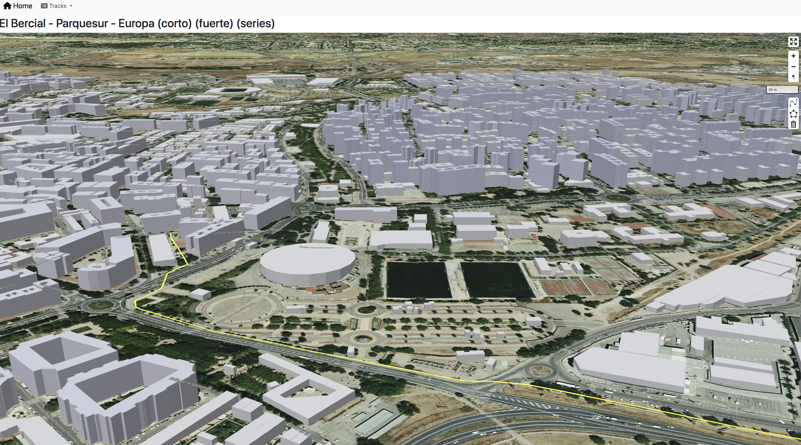
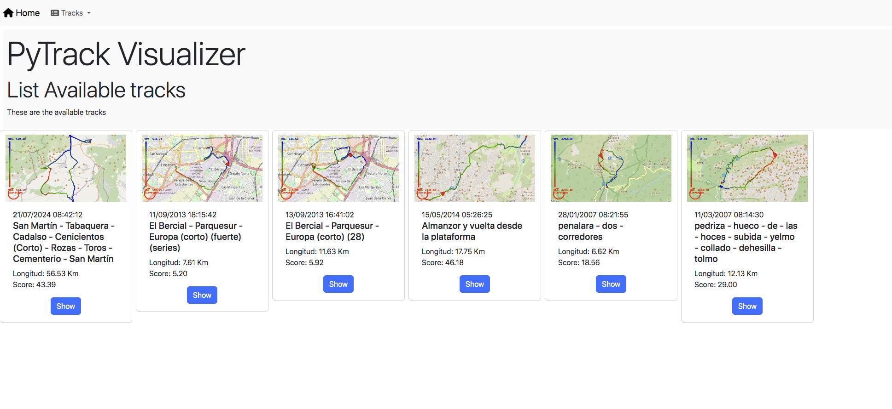
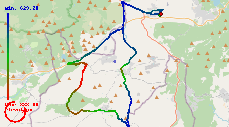

# pytrackvis
A simple Python GPX and FIT track file format visualization app on 2D / 3D Map using leafmap. Only accept FIT and GPX files. Try to keep the software standard and simple, getting only the required data. The maplibre install only works on python 3.11.x

</img>

</img>

</img>

</img>

</img>

## Libs

* [fitdecode](https://fitdecode.readthedocs.io/en/latest/) To read FIT files
* [gpxpy](https://github.com/tkrajina/gpxpy) To read GPX files
* [shapely](https://github.com/shapely/shapely) Manipulation and analysis of geometric objects in the Cartesian plane
* [flask](https://flask.palletsprojects.com/en/stable/) Flask is a lightweight WSGI web application framework
* [jinja2](https://jinja.palletsprojects.com/en/stable/) Jinja is a fast, expressive, extensible templating engine
* [flask_appconfig](https://pypi.org/project/flask-appconfig/) Allows you to configure an application using pre-set methods
* [itsdangerous](https://itsdangerous.palletsprojects.com/en/stable/) Sometimes you want to send some data to untrusted environments, then get it back later. To do this safely, the data must be signed to detect changes.
* [bootstrap-flask](https://bootstrap-flask.readthedocs.io/en/stable/) Bootstrap-Flask is a collection of Jinja macros for Bootstrap and Flask. 

* [flask_socketio](https://flask-socketio.readthedocs.io/en/latest/) Gives Flask applications access to low latency bi-directional communications between the clients and the server. 
* [flask-caching](https://fastkml.readthedocs.io/en/latest/index.html) a KML parser
* [fastkml]()
* [mapblox-gl-layers](https://github.com/developmentseed/mapbox-gl-layers)


These are for now not used.

* [leafmap](https://leafmap.org/installation/) Draw awesome maps
* [pydeck](https://pypi.org/project/pydeck/) Large scale interactive data visualization
* [flask_login](https://flask-login.readthedocs.io/en/latest/) Flask-Login provides user session management for Flask. 
  
* Install the modules with 
```
python -m pip install gpxpy fitdecode shapely jinja2==3.0 Flask==3.1.0 app_config itsdangerous==2.0.1 \
            bootstrap-flask flask_socketio Flask-Caching fastkml
```

## Info

* [Parsing fitness files](https://towardsdatascience.com/parsing-fitness-tracker-data-with-python-a59e7dc17418)
* [MAPLibre tutorial](https://geog-312.gishub.org/book/geospatial/maplibre.html)
* [MAPLibre github](https://github.com/eoda-dev/py-maplibregl?tab=readme-ov-file)
* [Leafmap maplibreGL](https://leafmap.org/maplibregl/)
  
## Fields

* `timestamp`. Timestamps in FIT messages are almost always given as the number of seconds since the Garmin Epoch `1989–12–31T00:00:00Z`
     

## Lets use Maplibre-gl-JS

https://documentation.maptiler.com/hc/en-us/articles/5224821308177-How-to-build-a-3D-map-with-MapLibre-v2-GL-JS

## run the webapp

 C:\Python312\Scripts\flask.exe  --app webapp run --host=0.0.0.0 --debug
 /Users/assman/Library/Python/3.10/bin/flask --app=webapp.py run  --debug

## TODO

* `/Archive/Cartography/files/FENIX3/2024/2024-01-25-17-13-31 - [RUN,FENIX3,RASE23] San Martín - Camino de Cadalso - Cementerio - San Martín.fit` check this track for problems in the optimizer (infinite coords)
* Add Preview
* Improve the Import code so we do the previsualization, initial map, and similar matching
* San Martín - Tabaquera - Cadalso - Cenicientos (Corto) - Rozas - Toros - Cementerio - San Martín (EDGE)
* 21/07/2024 08:42:12

## similar tracks using openCV method
`https://scikit-image.org/docs/stable/user_guide/install.html`
`C:\Python312\python.exe -m pip install opencv-python opencv-contrib-python`
https://stackoverflow.com/questions/11541154/checking-images-for-similarity-with-opencv
in mac, I have to test it using python 3.6 install.

python3.6 dev/test_ssim.py

On mac, python3.9 works flawless with cv2, flask and so on.
/usr/local/bin/flask --app=webapp.py run  --debug


## query natural model 

* [ln2sql](https://github.com/FerreroJeremy/ln2sql?tab=readme-ov-file)

## geojson sources

https://public.opendatasoft.com/explore/dataset/georef-spain-municipio/table/?disjunctive.acom_code&disjunctive.acom_name&disjunctive.prov_code&disjunctive.prov_name&disjunctive.mun_code&disjunctive.mun_name

